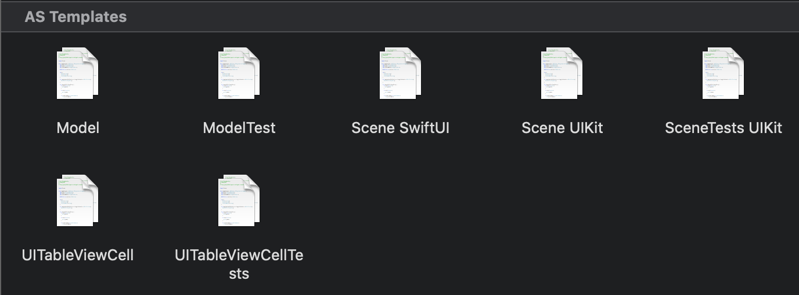

## XcodeTemplates

`XcodeTemplates` is the starting point of (almost) every new file created in Xcode by `Atelier Socle`. Each time we create a new file (either for test or new screen or business code), we always start by the same thing: cleaning Xcode default template, adding our coding style, etc. Starting now, we said stop to these steps, so we created our own templates.

## Intallation

To install the `AS Templates`, run in your terminal:

> `make` or `make install_templates` 

To uninstall them, run in your terminal:

> make uninstall_templates

## Templates

You'll find below a full list of all the templates available with a brief description of which one.

### Scenes Templates

#### [VIPER Scene UIKit](https://github.com/atelier-socle/xcode-templates/tree/master/AS%20Templates/VIPER%20Scene%20UIKit.xctemplate)

This template will generate a full VIPER scene, it will create: a `Builder`, an `UIViewController`, a `Presenter`, an `Interactor`, a `Router`, a `ViewModel`, and all the related protocols.  We won't explain what is a VIPER architecture, or how it works, but you can find more information about it [here](https://theswiftdev.com/2018/03/12/the-ultimate-viper-architecture-tutorial/).

**Note:** This temmplates comes with a demo using an `UITableView`, from here, it's your job to remove what you won't need, and adapt the output to your need.

**Note 2:** This template is using SwiftGen, if you are not, you will have to change how to instantiate the `UIViewController`.

#### [VIPER SceneTests UIKit](https://github.com/atelier-socle/xcode-templates/tree/master/AS%20Templates/VIPER%20SceneTests%20UIKit.xctemplate)

This template will generate all the files necessary to cover all the tests from the `VIPER Scene UIKit` template. If you generate both of them, you'll see that it will compile without any changes, and have a 100% test coverage.

#### [Scene SwiftUI](https://github.com/atelier-socle/xcode-templates/tree/master/AS%20Templates/Scene%20SwiftUI.xctemplate)

SwiftUI is still young, but we tried to find what will be a clean architecture for this framework. We ended with a light VIPER architecture composed of: a `Builder`, a `View`, a `Presenter`, an `Interactor`, a `ViewModel`, but which the _who does what_ is quite different. We won't explain it here, but you are welcome to play with it and tell us what do you think about it or how to improve it.

#### [SceneTests SwiftUI](https://github.com/atelier-socle/xcode-templates/tree/master/AS%20Templates/SceneTests%20SwiftUI.xctemplate)

This template will generate all the files necessary to cover all the tests from the `Scene SwiftUI` template. If you generate both of them, you'll see that it will compile without any changes. 

**Note:** we didn't find an effective way to test the `View` yet, any ideas are welcomed! 

### UIKit Templates

- [UITableViewCell](https://github.com/atelier-socle/xcode-templates/tree/master/AS%20Templates/UITableViewCell.xctemplate). This template will generate an `UITableViewCell`, with its xib, and delegate. The generated `UITableviewCell` is using [Reusable](https://github.com/AliSoftware/Reusable) to handle all the register/dequeue cell part.
- [UITableViewCellTests](https://github.com/atelier-socle/xcode-templates/tree/master/AS%20Templates/UITableViewCellTests.xctemplate): This template will generate all the files necessary to cover all the tests from the template `UITableViewCell`. 

### Business Templates

- [Model](https://github.com/atelier-socle/xcode-templates/tree/master/AS%20Templates/): This template will generate a model supporting by default `Decodable` and `Equatable`.
- [ModelTests](https://github.com/atelier-socle/xcode-templates/tree/master/AS%20Templates/ModelTests.xctemplate): This template will generate a model to cover all the tests from the `Model` template.

## Contributions

Pull requests and issues are always welcome. Please open any issues and PRs for bugs, features, or documentation. Note that we keep the right to reject any PRs that we don't feel to integrate in future `Atelier Socle` project.

## License

`XcodeTemplates` is licensed under the MIT license. See LICENSE for more info.
